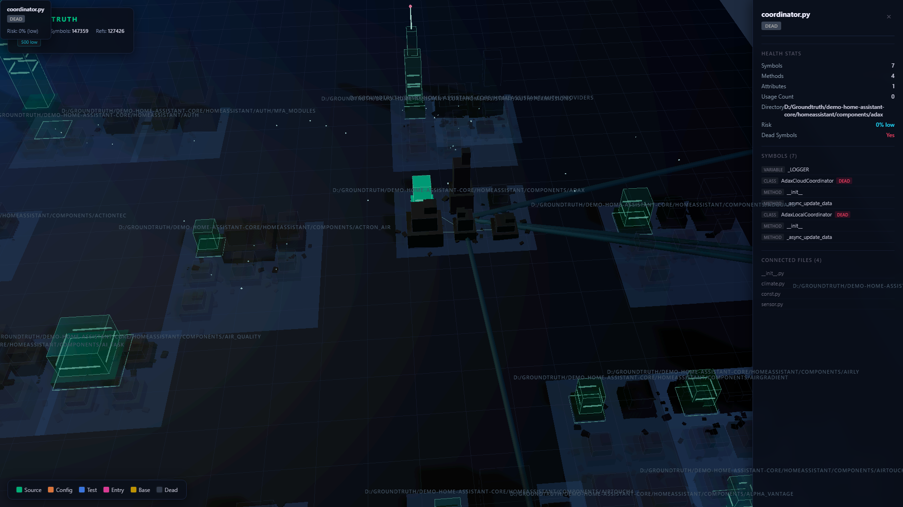

# GroundTruth

### The missing layer between AI coding agents and the codebases they edit.

AI agents hallucinate because they generate code from partial context. They see a few files, guess the rest, and produce plausible-looking code that silently breaks callers, misuses APIs, and invents imports that don't exist.

GroundTruth eliminates this class of failure. It pre-computes a complete call graph of your codebase and injects verified structural evidence into the agent's context at the exact moment it matters: before generation and after every edit. No AI calls. No embeddings. No token cost. Just facts.

**GroundTruth is a Python MCP server backed by a Go indexer.** Install with pip, configure in any MCP client. The Go binary (`gt-index`) is auto-downloaded on first use — no separate install step.



---

## Measured Impact

| Model | Without GT | With GT | Delta |
|-------|-----------|---------|-------|
| GPT-5 Mini | 277/500 (55.4%) | **289/500 (57.8%)** | **+12 tasks (+2.4pp)** |
| Gemini 2.5 Flash | ~343/500 | ~357/500 | **+14 tasks (+2.8pp)** |
| Gemini 3 Flash | 379/500 (75.80%) | 382/500 (76.4%) | **+3 tasks (+0.6pp)** |

*SWE-bench Verified, 500 tasks. Same model, same harness, same compute. The only difference: GroundTruth evidence. Waiting for official leaderboard numbers.*

The effect is consistent across model families: **+12 tasks with GPT-5 Mini**, +14 with Gemini 2.5, +3 with Gemini 3. The delta is larger on mid-tier models and compresses on frontier ones, exactly what you'd expect from a grounding system.

Both runs used the same scaffolding with a max cost cap of $1.25 per task. The baseline allowed up to $3 per task. We beat it by 12 tasks at less than half the per-task budget. The evidence layer itself adds $0: no additional LLM calls, no embeddings, no retrieval API. Just facts from the call graph.

**Key stats:**
- 100% evidence delivery, every task received a briefing
- 96% patch generation rate (vs 91% baseline)
- 57.8% resolve rate (vs 55.4% baseline)
- 7 evidence families: caller patterns, import paths, test assertions, git precedent, blast radius, type contracts, sibling conventions
- Same model, same harness, same token budget, same compute. GroundTruth is the only variable

### Reproduce Results

All results use [SWE-bench Verified](https://www.swebench.com/) (500 tasks) with [OpenHands](https://github.com/All-Hands-AI/OpenHands) CodeAct agent.

| Parameter | Baseline | With GT |
|-----------|----------|---------|
| Max cost/task | $3.00 | $1.25 |
| Agent | OpenHands CodeAct | OpenHands CodeAct + GT hook |
| Evidence cost | — | $0 (deterministic) |

**Methodology:** [`benchmarks/swebench/METHODOLOGY.md`](benchmarks/swebench/METHODOLOGY.md)

**Raw results:** Evaluation reports and per-task predictions are published as release assets on tagged versions.

---

## Why This Exists

Every AI coding tool today works the same way: embed files, retrieve by similarity, stuff into context, hope for the best. This fundamentally cannot answer:

- "Who calls this function and what do they do with the return value?"
- "If I change this signature, what breaks?"
- "What's the import path for this symbol? Not approximately, exactly."
- "Is this a critical-path function or dead code?"

These are **graph questions**, not similarity questions. GroundTruth answers them from a pre-computed call graph in <15ms, with zero AI cost.

---

## Architecture

```
                    ┌─────────────────────────────┐
                    │     Your Codebase            │
                    │  (any size, 30 languages)    │
                    └──────────┬──────────────────┘
                               │
                    ┌──────────▼──────────────────┐
                    │     gt-index (Go binary)     │
                    │  Tree-sitter AST parsing     │
                    │  Parallel workers            │
                    │  3-stage call resolution     │
                    │  Confidence scoring per edge │
                    └──────────┬──────────────────┘
                               │
                    ┌──────────▼──────────────────┐
                    │     graph.db (SQLite)        │
                    │  Nodes: functions, classes   │
                    │  Edges: calls + confidence   │
                    │  <15ms query latency         │
                    └──────────┬──────────────────┘
                               │
          ┌────────────────────┼────────────────────┐
          │                    │                     │
┌─────────▼────────┐ ┌────────▼─────────┐ ┌────────▼─────────┐
│   MCP Server     │ │  Evidence Engine  │ │   gt-resolve     │
│  16 tools, $0    │ │  7 evidence       │ │  LSP precision   │
│  Any MCP client  │ │  families         │ │  pass            │
└──────────────────┘ └──────────────────┘ └──────────────────┘
```

**Indexer:** Go binary using tree-sitter for AST extraction across 30 languages. Three-stage resolution pipeline: same-file (exact), import-verified (traced through import statements), name-match (fallback with confidence scoring). Every edge gets a confidence score from 0.0 to 1.0. Parallel parsing scales linearly with cores.

**Graph database:** SQLite with nodes (functions, classes, methods) and edges (call relationships). Includes indexes for sub-15ms query time even on 100K+ node graphs. The confidence column ensures agents only receive high-fidelity evidence.

**Evidence delivery:** 7 evidence families (import paths, caller usage patterns, sibling conventions, test assertions, blast radius, type contracts, git precedent) ranked and filtered by confidence. Output is structured `<gt-evidence>` blocks with `[VERIFIED]`/`[WARNING]` tiers so agents can weigh the information appropriately.

**MCP server:** 16 deterministic tools exposed via Model Context Protocol (stdio transport). Works with Claude Code, Cursor, Codex, Windsurf, and any client that speaks MCP. Every tool is $0 cost, no API keys required.

---

## Indexing Performance

| Repository | Files | Time | Nodes | Edges |
|-----------|-------|------|-------|-------|
| click | 105 | **334ms** | 1,067 | 2,066 |
| terraform | 3,241 | **7.5s** | 18,247 | 38,963 |
| cpython | 3,392 | **27s** | 93,516 | 194,872 |
| kubernetes | 18,456 | **1.5 min** | 77,526 | 224,197 |
| sentry | 16,798 | **56s** | 45,847 | 73,289 |

Monorepo-ready. Parallel parsing with batch SQLite inserts. O(1) resolution lookups.

---

## Language Support

GroundTruth is language-agnostic. Verified on real-world repos:

| Language | Depth Score | Validated On | Assertions | Properties |
|----------|------------|--------------|------------|------------|
| **Java** | 13/14 | google/gson (3,814 nodes) | 3,766 | 3,960 |
| **Rust** | 14/14 | BurntSushi/memchr (926 nodes) | 7 | 953 |
| **C++** | 13/14 | gabime/spdlog (631 nodes) | 19 | 846 |
| **Go** | 12/14 | labstack/echo (1,161 nodes) | 1,617 | 1,555 |
| **JavaScript** | 13/14 | expressjs/express (224 nodes) | 113 | 118 |
| **TypeScript** | 13/14 | fixture (63 nodes) | 6 | 48 |
| **Python** | 12/14 | fixture (54 nodes) | 7 | 88 |

**17 languages with import resolution:** Python, Go, JS, TS, Java, Rust, C#, Kotlin, Scala, Groovy, PHP, C, C++, Swift, OCaml, Ruby, Elixir, Lua

**13 additional languages** with structural parsing: Bash, Lua, HTML, Markdown, YAML, TOML, SQL, HCL, CSS, Elm, Cue, Svelte, Protobuf

---

## Installation

One command. Works for any language.

```bash
pip install git+https://github.com/harneet2512/groundtruth.git
```

**Or with `uvx` (no permanent install):**

```bash
uvx --from git+https://github.com/harneet2512/groundtruth.git groundtruth serve --root .
```

The `gt-index` binary (Go, tree-sitter, 30 languages) is **auto-downloaded** on first use. No separate install step. No Go compiler needed.

---

## Quick Start

```bash
# Start the MCP server — auto-indexes your project on first run
groundtruth serve --root /path/to/repo
```

That's it. The server auto-detects `gt-index`, indexes your codebase, and serves 16 tools over MCP.

---

## Connect to Your IDE

**Claude Code** (add to `.claude/mcp.json`):
```json
{
  "mcpServers": {
    "groundtruth": {
      "command": "groundtruth",
      "args": ["serve", "--root", "."]
    }
  }
}
```

**Or with `uvx` (no install needed):**
```json
{
  "mcpServers": {
    "groundtruth": {
      "command": "uvx",
      "args": ["--from", "git+https://github.com/harneet2512/groundtruth.git", "groundtruth", "serve", "--root", "."]
    }
  }
}
```

**Cursor** (add to `.cursor/mcp.json`):
```json
{
  "mcpServers": {
    "groundtruth": {
      "command": "groundtruth",
      "args": ["serve", "--root", "."]
    }
  }
}
```

**Windsurf / Codex / any MCP client**: same pattern. Point the MCP server command at `groundtruth serve --root .`.

---

## MCP Tools

16 tools. All deterministic. All $0.

| Tool | Purpose |
|------|---------|
| `groundtruth_brief` | Pre-generation briefing with signatures, patterns, constraints |
| `groundtruth_find_relevant` | Task description to ranked relevant files |
| `groundtruth_validate` | Post-generation structural check |
| `groundtruth_trace` | Full caller/callee chains |
| `groundtruth_impact` | Blast radius: what breaks if you change this |
| `groundtruth_explain` | Deep symbol dive with source and dependencies |
| `groundtruth_hotspots` | Most-referenced symbols in the codebase |
| `groundtruth_symbols` | File-level symbol listing with import graph |
| `groundtruth_context` | Usage patterns with surrounding code |
| `groundtruth_patterns` | Coding conventions from sibling files |
| `groundtruth_orient` | Codebase structure overview |
| `groundtruth_checkpoint` | Session progress and recommendations |
| `groundtruth_dead_code` | Unreferenced exported symbols |
| `groundtruth_unused_packages` | Installed but unimported dependencies |
| `groundtruth_status` | Index health and statistics |
| `groundtruth_do` | Natural language auto-router |

---

## Evidence Format

```xml
<gt-evidence>
[VERIFIED] FIX HERE: getUserById() at src/users/queries.py:47 (1.00)
  signature: def getUserById(user_id: int) -> User
  [VERIFIED] 12 callers in 4 files, CRITICAL PATH (0.67)
  [WARNING] MUST satisfy return contract: returns User, not Optional[User] (0.33)
</gt-evidence>
```

Evidence is tiered by edge confidence:
- `[VERIFIED]`: confidence >= 0.9 (import-verified or unambiguous)
- `[WARNING]`: confidence 0.5-0.9 (probable but not certain)
- Below 0.5: filtered out, never shown to the agent

---

## 3D Code City

```bash
groundtruth viz --root /path/to/repo
```

Interactive Three.js visualization. Buildings are modules, height is complexity, color is risk level, lines are dependencies. Click any building to inspect its symbols.

---

## Development

```bash
# Install dev dependencies
pip install -e ".[dev]"

# Run all tests (1003 collected; count varies with environment)
pytest tests/ -v --ignore=tests/integration/test_real_lsp.py --timeout=60

# Run with coverage
pytest tests/ -v --cov=src/groundtruth --cov-report=term-missing --timeout=60

# Lint
ruff check src/groundtruth/ tests/
ruff format --check src/groundtruth/ tests/
```

Go indexer:
```bash
cd gt-index && CGO_ENABLED=1 go build -o gt-index ./cmd/gt-index/
CGO_ENABLED=1 go test ./...
```

**Test fixtures:** Cross-language sample projects (Python, TypeScript, Go, Java, Rust) under `tests/fixtures/`.

---

## Limitations

- **70-80% of edges are name-match** on large repos. Confidence scoring mitigates false positives but does not eliminate them.
- **No incremental indexing.** Every `gt-index` run is a full re-index. Fast for most repos (<30s), but enterprise monorepos (100K+ files) take minutes.
- **Tier 2 languages** (13 of 30) have structural parsing only — no import resolution, edges are speculative.
- **Evidence quality scales with graph quality.** On repos where most edges are low-confidence name-match, the evidence is less reliable.
- **`groundtruth_validate` returns `degraded: true` without a language server.** Only syntax-level (AST) checks run when no LSP is active. Import correctness, type errors, and missing symbols are not verified. A `null` value for `valid` means "unknown", not "pass". Start a language server (e.g. `pyright`, `typescript-language-server`) for full validation.
- **Binary auto-download requires internet on first run.** The `gt-index` binary is downloaded from GitHub Releases and verified with SHA256 on first use. Subsequent runs use the cached binary at `~/.groundtruth/bin/`. Offline environments must build from source: `cd gt-index && CGO_ENABLED=1 go build -o gt-index ./cmd/gt-index/`.
- **Windows terminal encoding:** The CLI assumes UTF-8-capable output. On Windows with default `cmd.exe` (cp1252), Unicode characters in output are replaced with `?` rather than crashing. For full Unicode, run `chcp 65001` before starting or set `PYTHONIOENCODING=utf-8`.

---

## For Evaluators

**Quick demo (60 seconds):**
```bash
pip install git+https://github.com/harneet2512/groundtruth.git
groundtruth serve --root /path/to/any/repo
# In another terminal or MCP client:
# → groundtruth_status (health check)
# → groundtruth_trace --symbol "your_function" (caller/callee chains)
# → groundtruth_brief --file "src/main.py" (pre-generation briefing)
```

**What is production-ready:** MCP server, 16 tools, Go indexer, evidence engine, 30-language parsing.

**What is experimental:** 3D Code City visualization, AI semantic resolver, LSP edge resolution.

---

## License

MIT
